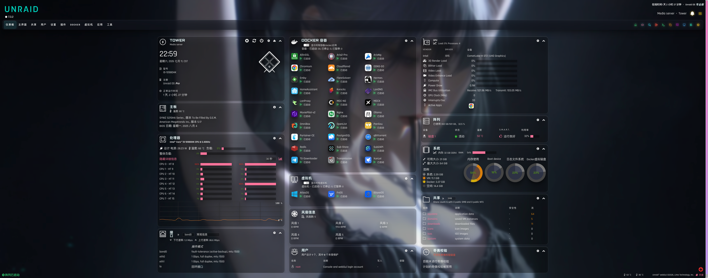

# Unraid Custom WebUI CSS 主题

这是一个基于 **Custom WebUI CSS** 插件实现的 Unraid WebGUI 自定义主题。

本主题基于 Unraid 7.3.2 WebGUI 界面适配制作，适用于 Custom WebUI CSS 插件部署。主题包含主样式、深色模式兼容样式与背景图片资源，主要优化顶部导航、模块圆角、玻璃拟态背景、小屏横向滚动以及设置、用户等页面的视觉一致性。最新版保留 Community Applications 的原生布局，避免与新版 Apps 页面重复定制。

## 效果预览



## 主题文件

```text
/boot/config/plugins/custom.css/
├── style.css
├── style-black.css
└── assets/
    └── background.jpg
```

## 安装前准备

1. 打开 Unraid 的 **Apps / Community Applications**。
2. 搜索并安装 **Custom WebUI CSS** 插件。
3. 确认 Unraid 可以访问 GitHub Raw 文件地址。

本主题使用的是 Custom WebUI CSS 插件，不是 Theme Engine。

## 一键安装

在 Unraid 终端执行：

```bash
bash <(curl -fsSL https://raw.githubusercontent.com/deltrivx/unraid-custom-webui-css/main/scripts/install.sh)
```

在交互式终端中运行时，脚本会列出 `latest` 和历史时间版本供选择；通过管道或自动化环境执行时默认安装 `latest`。安装完成后刷新 Unraid WebGUI 页面即可。

列出可用版本：

```bash
bash <(curl -fsSL https://raw.githubusercontent.com/deltrivx/unraid-custom-webui-css/main/scripts/install.sh) --list
```

指定版本进行非交互安装：

```bash
bash <(curl -fsSL https://raw.githubusercontent.com/deltrivx/unraid-custom-webui-css/main/scripts/install.sh) --version latest
```

例如安装旧版完整 Apps 定制：

```bash
bash <(curl -fsSL https://raw.githubusercontent.com/deltrivx/unraid-custom-webui-css/main/scripts/install.sh) --version 20260711-231949
```

## 手动安装

如果你希望手动部署，可以在 Unraid 终端执行：

```bash
mkdir -p /boot/config/plugins/custom.css/assets
mkdir -p /usr/local/emhttp/plugins/custom.css/assets

curl -fsSL -o /boot/config/plugins/custom.css/style.css \
  https://raw.githubusercontent.com/deltrivx/unraid-custom-webui-css/main/versions/latest/style.css
curl -fsSL -o /boot/config/plugins/custom.css/style-black.css \
  https://raw.githubusercontent.com/deltrivx/unraid-custom-webui-css/main/versions/latest/style-black.css
curl -fsSL -o /boot/config/plugins/custom.css/assets/background.jpg \
  https://raw.githubusercontent.com/deltrivx/unraid-custom-webui-css/main/versions/latest/assets/background.jpg

printf 'SERVICE="enabled"\n' > /boot/config/plugins/custom.css/custom.css.cfg

cp /boot/config/plugins/custom.css/style.css /usr/local/emhttp/plugins/custom.css/style.css
cp /boot/config/plugins/custom.css/style-black.css /usr/local/emhttp/plugins/custom.css/style-black.css
cp /boot/config/plugins/custom.css/assets/background.jpg /usr/local/emhttp/plugins/custom.css/assets/background.jpg
```

## 更新主题

再次执行一键安装命令即可更新到仓库最新版：

```bash
bash <(curl -fsSL https://raw.githubusercontent.com/deltrivx/unraid-custom-webui-css/main/scripts/install.sh)
```

历史版本不会被覆盖；版本列表记录在 `versions/index.json`。详细变更见 [CHANGELOG.md](CHANGELOG.md)。

脚本只会覆盖本仓库管理的主题文件：

- `style.css`
- `style-black.css`
- `assets/background.jpg`

## 显示设置

安装后建议打开 Unraid：

```text
Settings -> Display Settings
```

将深色界面中主要字体颜色调整为白色或接近白色，避免文字在背景图和玻璃拟态模块上对比度不足。

推荐值：

```text
Page text color: #ffffff
Header text color: #ffffff
Menu text color: #ffffff
```

不同 Unraid 版本或插件环境下字段名称可能略有差异，核心目标是让页面正文、标题和菜单文字保持白色或接近白色。

## 回滚

如果需要停用主题，可以先在插件设置中关闭 **Custom WebUI CSS**。

也可以手动删除主题文件：

```bash
rm -f /boot/config/plugins/custom.css/style.css
rm -f /boot/config/plugins/custom.css/style-black.css
rm -f /boot/config/plugins/custom.css/assets/background.jpg
rm -f /usr/local/emhttp/plugins/custom.css/style.css
rm -f /usr/local/emhttp/plugins/custom.css/style-black.css
rm -f /usr/local/emhttp/plugins/custom.css/assets/background.jpg
```

然后刷新 Unraid WebGUI。

## 常见问题

### 样式没有生效

检查 Custom WebUI CSS 是否已启用：

```bash
cat /boot/config/plugins/custom.css/custom.css.cfg
```

正常应看到：

```text
SERVICE="enabled"
```

再检查运行目录是否存在文件：

```bash
ls -la /usr/local/emhttp/plugins/custom.css/
ls -la /usr/local/emhttp/plugins/custom.css/assets/
```

### 背景图没有显示

确认背景图已下载到两个位置：

```bash
ls -lh /boot/config/plugins/custom.css/assets/background.jpg
ls -lh /usr/local/emhttp/plugins/custom.css/assets/background.jpg
```

### 页面还是旧效果

尝试强制刷新浏览器缓存：

```text
Windows / Linux: Ctrl + F5
macOS: Command + Shift + R
```

如果仍未生效，可以关闭再启用 Custom WebUI CSS 插件，然后重新刷新页面。

## 文件说明

- `style.css`：主题主样式文件。
- `style-black.css`：黑色主题兼容/覆盖样式。
- `assets/background.jpg`：主题背景图片。
- `scripts/install.sh`：一键安装脚本。
- `versions/latest/`：当前推荐版本。
- `versions/<时间版本>/`：不可变历史版本归档。
- `versions/index.json`：安装脚本使用的版本清单。
- `CHANGELOG.md`：版本更新记录。
- `docs/display-settings.md`：显示设置说明。
- `docs/troubleshooting.md`：排错说明。
